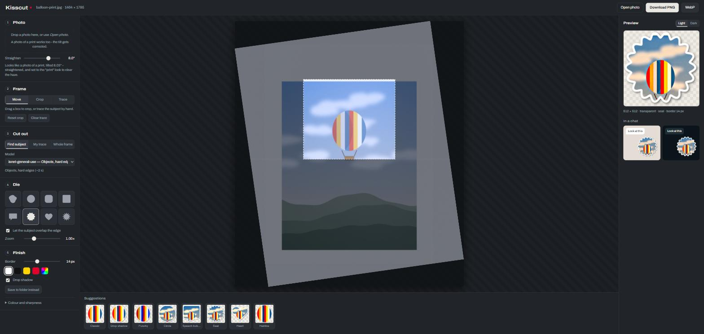
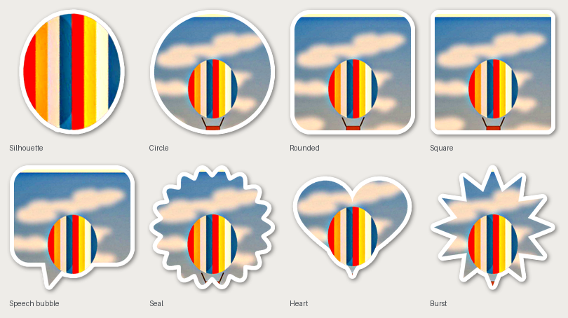

# Kisscut

[](https://github.com/Supportlik/Kisscut/actions/workflows/ci.yml)
[](https://www.python.org/)
[](LICENSE)

**Kisscut** — named after the cut that makes a sticker a sticker: the blade goes through
the vinyl but not the backing paper, so the shape lifts off and the sheet stays whole.
That is the job here. Kisscut turns a photo into a **WhatsApp sticker**: it cuts the
subject out, cuts that to a shape, lays an even white border around it and writes a
512×512 PNG and WebP.

It is built for the awkward source material — the picture you took of a print lying on
the table, tilted, hazy from the lamp and blue from the evening light. Those three faults
get corrected before anything is cut out.

Everything runs on your machine. No upload, no account, no network after the segmentation
models have been fetched once.



## How it works

```
photo -> straighten -> crop -> develop -> cut out -> die -> border -> 512x512 PNG + WebP
```

1. **Straighten.** A photographed print sits at an angle. Kisscut follows the top edge
   of the print across the frame and measures its slope, so the tilt is gone before you
   touch anything. An ordinary photo is left alone.
2. **Crop** to what matters, by dragging a box.
3. **Develop.** Four presets, plus sliders. `as-shot` is the default and changes
   nothing but a touch of sharpening, because a sticker should look like the photo it
   came from. `print` runs the full repair chain — gray-world white balance against the
   colour cast, a black point against the veil, lifted shadows, a large-radius local
   contrast pass that clears reflection haze — and is selected automatically when a
   tilted print is detected, since on an ordinary snapshot that same chain would wash
   the colours out.
4. **Cut out.** Let a model find the subject, trace it by hand, or keep the whole frame.
5. **Die.** Follow the subject's own silhouette, or cut it to one of seven shapes — with
   the subject allowed to overlap the edge.
6. **Border.** An even outline in any colour, laid on with a distance transform so it is
   exactly as wide in a sharp corner as along a straight edge. Optional drop shadow.

## Installation

Requires Python ≥ 3.10. Not on PyPI yet, so install it from the repository:

```bash
git clone https://github.com/Supportlik/Kisscut.git
cd Kisscut

uv tool install .              # as an isolated tool, then: kisscut serve
uv run kisscut serve           # or straight from the checkout
pip install -e .               # or into the current environment
```

The cutout models come from [rembg](https://github.com/danielgatis/rembg) and download
themselves the first time you use one (a few hundred MB, cached in `~/.u2net/`). Shapes,
borders and photo repair work without them.

## Quick start

```bash
kisscut serve
```

That opens the studio at `http://127.0.0.1:8731/`. Drop a photo in, work down the five
steps on the left, watch the preview on the right — including how it will look at actual
size in a light and a dark chat — and press **Download PNG** or **WebP**. (There is also
a *Save to folder* button, which writes both files to `stickers/` instead.)

Everything except the cutout itself reacts immediately: segmenting is cached per crop and
developing per look, so moving the border slider re-renders in about a tenth of a second.
A fresh cutout costs a few seconds, and the model list says which models are the quick
ones.

Without the interface:

```bash
kisscut make photo.jpg --shape bubble --border 18
kisscut make photo.jpg --model birefnet-portrait --look punchy --no-shadow
kisscut make scan.png --source full --shape circle --rotate 0
```

## The dies



`silhouette` follows whatever the cutout step kept. The other seven are geometric, fill
with the photo, and let the subject break out past the edge (`--no-pop-out` keeps it
inside).

## Cutting out

Three ways, because no single one handles every picture:

| Way | When |
| --- | --- |
| **Find subject** | The usual case. Five models; `birefnet-portrait` is cleanest on people, `birefnet-general-lite` keeps more of the surroundings. |
| **Trace** | When the model drops something you want — an arm in shadow, a second person. Draw around it on the canvas. |
| **Whole frame** | For a photo-in-a-frame look, or when the die does the shaping. |

There is a fourth way for anyone who would rather use their own image editor: draw a
line around the subject in **pure red** (255, 0, 0), save a copy, and
`cutout.by_red_line()` reads it back as a mask. It floods inward from the border instead
of filling holes, so an outline running close to the edge still works.

## What comes out

512×512, transparent, centred, with a margin so the border never touches the edge. The
PNG is the archive copy; the WebP is the one WhatsApp wants, written at the best quality
that still fits under the 100 KB limit for static stickers — quality is stepped down
until it does, rather than being fixed at a guess.

## Sample photos

`examples/` holds three generated pictures, so the whole thing can be tried without
supplying a photo of your own:

| File | What it exercises |
| --- | --- |
| `balloon-print.jpg` | A print lying on paper at 8°, hazy and blue — straightening and developing |
| `balloon-print-marked.png` | The same with a red pen outline — `cutout.by_red_line()` |
| `mug-shelf.jpg` | A plain snapshot against a busy background — dies and cutouts |

They are drawn by `examples/make_samples.py`, not photographed, so the repository
contains no pictures of anyone.

## Development

```bash
uv run pytest -m "not models"   # the suite CI runs - no model downloads
uv run pytest                   # everything, fetches a model on first run
uv run python examples/make_samples.py
```

The render path is shared: the studio, the command line and the tests all go through
`Workshop.render()`, so a preview cannot drift from the saved file.

Two decisions are worth knowing before changing anything. The working resolution
(`WORK_EDGE`) is deliberately well above the 512 px output: a subject filling part of the
frame has to be scaled *down* into the sticker, and upscaling is exactly what makes a
cutout look washed out. And the border is traced with a distance transform, which needs a
yes-or-no mask and can therefore only be one pixel soft — so `add_border` measures the
mask at three times the size and scales the ring back down, leaving the photo itself
untouched.

## License

MIT — see [LICENSE](LICENSE).
